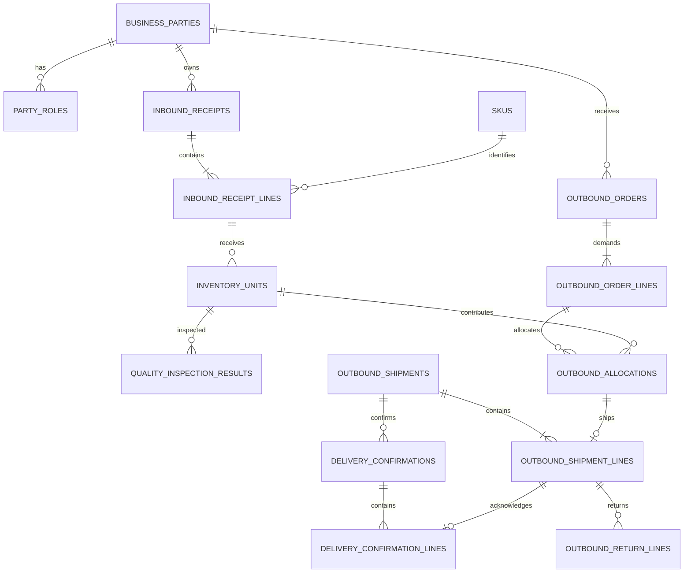

# 库存管理平台 V2 总体设计

状态：设计基线草案  
日期：2026-07-30  
适用仓库：`inventory-manager`

## 1. 目标与范围

本次升级不是把 Excel 文件换成一个数据库文件，而是把当前“按条码记录出货和退货”的工具升级为具备完整业务事实链的库存系统：

```text
货主/供货客户 -> 入库批次 -> 单件条码/SN -> 质检 -> 在库/预留
                                            -> 上游订单凑单 -> 出库 -> 交货确认 -> 退回/完成
```

系统必须同时交付两种部署形态，并共享同一套 Rust 领域逻辑、逻辑数据模型和业务规则：

- 离线单用户版：Tauri 桌面应用、本地 SQLite 文件、离线激活码，不依赖网络即可完成业务操作。
- 网络多用户版：Tauri 桌面客户端连接 Rust 服务端和共享 PostgreSQL，账号密码登录，服务端验证用户权限和租户授权。
- 两种版本通过受控的数据迁移包互相迁移；第一版采用一次性升级，不实现两个数据库的实时双向同步。

Excel 降级为导入、导出和报表交换格式，不再作为业务事实源。

## 2. 业务术语与当前假设

当前软件中的“客户”含义过载。V2 必须拆开以下概念：

| 术语 | 含义 | 示例 |
| --- | --- | --- |
| 货主/供货客户 | 把货交给仓库、参与凑单的一方 | 客户 A 提供 6 件 |
| 上游收货方 | 提出交货需求并接收凑单货物的一方 | 上游公司要求 10 件 |
| 产品型号（SKU） | 可归类、统计的产品型号 | 镁光 32G 3200 |
| 库存单件 | 有唯一条码或 SN 的实物 | SN `H0I...` |
| 入库批次 | 同一业务来源的一次收货事实 | 客户 A 于某时入库一批 |
| 上游订单 | 上游收货方提出的型号和数量需求 | 型号 X，需求 10 件 |
| 分配/凑单 | 从不同货主、批次选货满足同一订单 | A 6 件 + B 4 件 |
| 出库批次 | 实际从仓库发出的一次操作 | 一张发货/交货单 |
| 交货确认 | 上游实际接收的确认事实 | 确认码、时间、凭证 |

本设计暂按以下业务假设推进：

1. 当前条码主要是一物一码；所有历史和追踪能力以单件库存为第一优先。
2. 入库时质检状态默认为 `untested`（未测试）。
3. 未测试和测试失败的货物默认不能出库；只有具备“质检放行”权限的人可以创建有理由、有审计记录的例外放行。
4. 一张上游订单允许多个货主、多个入库批次、多个出库批次共同满足。
5. “交货后的编码在入库管理中标注”通过关联查询和状态投影实现：入库事实不被覆盖，但入库详情能直接看到对应上游订单、出库单、交货确认码和时间。
6. 第一版采用一次性升级：离线数据导入新的网络工作区后，网络 PostgreSQL 成为唯一事实源，原离线库归档为只读；两个已经分别产生业务数据的数据库不自动合并。

如果“客户”在实际业务中另有含义，只需调整业务角色名称，不应回退到把货主和上游收货方存进同一个模糊字段。

## 3. 现状审计结论

### 3.1 `main` 分支

当前主分支仅在内存中维护：

```text
shipments: barcode -> { customer, shipment_time }
returns:   barcode -> return_time
```

主要问题：

- Excel 导入会清空当前内存数据，文件仍然是事实源和保存边界。
- 没有入库、产品型号、货主、仓库位置和质检事实。
- 出货固定绑定一个模糊的 `customer` 字段，无法表达多货主凑单。
- 退货只能追到出货条码，无法追到入库批次、质检和原始货主。
- 没有数据库事务、并发控制、用户权限或结构化业务审计。
- 离线激活已经存在，应保留其“Rust 后端统一验签”的安全边界。

### 3.2 `data-model-experiment` 分支

该实验分支包含约 4.7 万行新增代码、34 个 PostgreSQL migration，以及账号、RLS、幂等、审计、同步、报表和财务等基础设施。它从 `v0.2.5` 附近分叉，尚未包含主分支最新离线激活方案，并且库存核心仍有以下阻断问题：

- 没有真正的入库单、入库行、货主和质检模型。
- `RecordShipmentBatch` 仍是一批对应一个客户，不能表达多货主凑单。
- 出库遇到数据库中不存在的条码时会自动创建 `on_hand` 库存单件，破坏“先入库、后质检、再出库”的事实链。
- 当前 UI 最新提交偏向财务工作区，不能直接作为本次仓储升级的用户界面基线。
- 分支删除了当前离线激活模块，整分支合并会产生错误的授权回退。
- 登录失败次数在事务中更新后直接返回错误，事务回滚会导致失败次数可能无法累计；账号安全实现不能原样移植。
- 部分租户表的 RLS、幂等并发和同步原子性仍未达到其设计文档声称的强度。
- PostgreSQL 集成测试在缺少数据库连接时会跳过并返回成功，CI 存在假绿风险。

处理原则：不整分支合并。账号会话、RLS、幂等、审计、备份脚本和部分报表基础设施可在新 schema 冻结后选择性移植；库存写模型需要重做。

### 3.3 多 agent 设计评审共识

领域模型、离线/网络架构和现有实现审计的独立评审结论一致：

- 先冻结“入库—质检—可用库存—凑单—出库”的最小垂直链路，再考虑财务和复杂同步。
- 离线版和网络版不能维护两套业务 schema，也不能继续保留内存 `HashMap` 作为另一套事实源。
- SQLite 和 PostgreSQL 的逻辑模型、状态机和领域测试必须一致；两者的物理 migration 可以分别实现。
- 网络账号认证与产品授权是两个不同判定，两者都通过后业务请求才可以执行。
- 数据互迁必须采用领域迁移包和 staging 校验，`pg_dump` 仅用于同一实例的灾难恢复。

## 4. 参考系统 MCP 实查结论

对已登录的 `https://mz.bizgo.com/index.html` 做了只读检查，观察到：

- 左侧按客户、供应商、销售单、采购单、退货单、产品、库存、报表、员工和业务日志拆分主模块。
- 采购单同时显示供应商、采购日期、收货状态、产品、SN 码、总数量和收货数量。
- 库存列表提供搜索、扫码、期初/盘点、导出、库存数量、成本均价和更新时间。
- 员工管理提供角色和禁用状态，业务日志记录时间、设备、操作人、操作类型和关联业务单号。
- 系统存在“严格进销存”“SN 管理”“退货模块”等业务开关。

可借鉴：

- 左侧稳定模块导航、顶部页签、单据列表和详情分层。
- 单据状态与收货/送货状态分开显示。
- SN 码是一等字段，业务日志必须能反查关联单据。
- 角色权限、员工禁用、盘点和导出作为独立能力呈现。

不能照搬：

- 本项目的“货主参与上游凑单”不是普通采购/销售关系，必须显式建模。
- 质检不是一个入库布尔字段，而是允许复检、记录缺陷和责任人的历史事实。
- 严格库存规则不应成为可随意关闭的前端开关；“不存在的条码不能出库”必须是服务端硬约束。

## 5. 总体架构

```text
                            网络多用户版
Tauri React UI -> Rust Tauri Adapter -> TLS/gRPC -> Rust Server -> PostgreSQL
       |                 |                             |
       |                 |                             +-- 账号/RBAC/租户授权
       |                 |                             +-- 领域事务/审计/备份
       |                 |
       |                 +-------------------------+
       |                                           |
       +---------------- 离线单用户版 --------------+
                          Rust Application Services -> SQLite
                          离线激活验签 / 本地备份 / 一次性升级包
```

架构决策：

- 前端只负责交互和展示，不直接连接数据库，也不自行判断授权或最终库存状态。
- Rust 领域服务定义入库、质检、分配、出库、交货和退回规则。
- 离线适配器在进程内调用领域服务；网络适配器通过 `tonic` gRPC 调用同一用例边界。
- SQLite 和 PostgreSQL 分别通过 SQLx repository 访问；两套物理 migration 映射到同一逻辑 schema，不把 SQLite 数据库文件直接当成 PostgreSQL 备份。
- 服务端采用模块化单体，不在第一版拆微服务、消息总线或每租户独立数据库。
- Excel 处理在 Rust 后端完成，导入必须经过预览和提交两个阶段。

建议逐步把当前单个 `src-tauri/src/lib.rs` 拆为：

```text
crates/
  inventory-domain/       # 实体、值对象、状态机，不依赖 Tauri/SQLx
  inventory-application/  # 用例、事务边界、权限要求、端口
  inventory-sqlite/       # 离线 SQLx repository、SQLite migrations、备份
  inventory-postgres/     # 网络 SQLx repository、PostgreSQL migrations、RLS
  inventory-protocol/     # gRPC proto 和 DTO
  inventory-server/       # 网络版服务端、登录、授权、备份任务
src-tauri/                 # Tauri 命令、离线/远端适配、对话框、声音
src/                       # React 页面
```

第一阶段不必一次性完成目录重构，但新领域代码不能继续堆入现有的巨型 `lib.rs`。

## 6. 共享逻辑数据模型

### 6.1 通用规则

- 主键使用 UUIDv7；业务单号是可读编号，不作为关系主键。
- 网络版所有业务表带 `tenant_id`；同租户外键使用 `(tenant_id, id)` 复合约束。
- 时间使用 `TIMESTAMPTZ` 并以 UTC 存储；界面按工作区时区显示。
- 所有正式数量使用明确精度；一物一码单件数量固定为 1。
- 单据采用 `draft -> posted -> voided` 等明确状态；已过账事实不允许静默修改。
- 高频可变状态使用 `TEXT + CHECK` 或状态表，不优先使用难迁移的 PostgreSQL ENUM。
- 正式业务写操作都包含 `request_id` 和 `idempotency_key`。
- 离线 SQLite 也保存稳定 UUID、工作区 ID、版本号、来源实例 ID 和 UTC 时间，保证一次性升级时不需要重写关系。
- PostgreSQL 的 RLS、复合外键和服务端并发约束是网络版额外的数据库安全层；离线版由单用户边界、Rust 用例和 SQLite 约束共同保证。

### 6.2 表分组

#### 租户、账号和授权

| 表 | 关键内容 |
| --- | --- |
| `tenants` | 网络版授权和数据隔离边界 |
| `workspaces` | 业务工作区、时区、默认仓库 |
| `users` / `credentials` | 用户及 Argon2id 密码凭证 |
| `memberships` | 用户进入租户后的身份和状态 |
| `roles` / `permissions` / `membership_roles` | RBAC |
| `devices` / `sessions` / `refresh_tokens` | 设备、会话和吊销 |
| `license_entitlements` | 网络版租户授权、版本、席位、功能、起止时间和签名 |
| `offline_installations` | 离线版机器码、激活声明和验签结果 |

#### 主数据

| 表 | 关键内容 |
| --- | --- |
| `business_parties` | 统一保存公司或个人，不把同一主体重复存成客户和供应商 |
| `party_roles` | `goods_owner`、`upstream_receiver`、`supplier`、`carrier` 等角色 |
| `skus` | 型号编码、名称、规格、条码追踪方式、启用状态 |
| `warehouses` / `locations` | 仓库、库位、隔离区、待检区 |

#### 入库和库存单件

| 表 | 关键内容 |
| --- | --- |
| `inbound_receipts` | 入库单号、货主、来源单号、入库时间、仓库、状态、制单人 |
| `inbound_receipt_lines` | 入库行、SKU、申报数量、已扫码数量、批次备注 |
| `inventory_units` | 唯一条码/SN、入库行、货主、SKU、库位、当前库存状态、质检投影、版本 |
| `stock_movements` | 只追加的库存流水，记录收货、移库、预留、出库、交货、退回、报损和更正 |

#### 质检

| 表 | 关键内容 |
| --- | --- |
| `quality_inspections` | 一次质检或复检的单据头、类型、人员、开始/完成时间、状态 |
| `quality_inspection_results` | 每个库存单件的结果、缺陷码、测量值 JSON、备注和附件引用 |
| `quality_waivers` | 例外放行人、原因、有效范围和审计引用 |

`inventory_units.quality_status` 只是最新状态投影，历史以质检结果和放行记录为准。允许状态：

```text
untested -> testing -> passed
                    -> failed -> retest -> passed/failed
failed/untested -> waived（仅授权放行，必须说明原因）
```

#### 上游订单、凑单和出库

| 表 | 关键内容 |
| --- | --- |
| `outbound_orders` | 上游收货方、订单号、需求日期、状态、备注 |
| `outbound_order_lines` | SKU、需求数量、已分配/已出库/已交货数量投影 |
| `outbound_allocations` | 订单行与库存单件的 M:N 分配，保留货主和入库批次来源 |
| `outbound_shipments` | 实际出库批次、承运信息、出库时间、操作人 |
| `outbound_shipment_lines` | 出库批次、分配记录、库存单件、扫码快照 |
| `delivery_confirmations` | 上游确认码、确认时间、确认人、凭证和异常 |
| `delivery_confirmation_lines` | 逐件关联出库行，支持部分签收、拒收和异常说明 |
| `outbound_return_batches` / `outbound_return_lines` | 关联原出库行的退回事实、原因和处置结果 |

核心关系：



这使一张需求 10 件的上游订单可以拥有如下分配：

| 订单行 | 货主 | 入库批次 | 分配数量 |
| --- | --- | --- | ---: |
| 型号 X / 10 件 | 客户 A | RK-001 | 4 |
| 型号 X / 10 件 | 客户 A | RK-003 | 2 |
| 型号 X / 10 件 | 客户 B | RK-002 | 4 |

入库详情通过 `inventory_unit -> allocation -> shipment_line -> delivery_confirmation` 展示“已交货、交给谁、哪张单、何时确认”，但不会改写 `inbound_receipts`。

#### 导入导出、审计和同步基础

| 表 | 关键内容 |
| --- | --- |
| `import_jobs` / `import_job_rows` | 原文件摘要、列映射、预览错误、提交结果和幂等键 |
| `export_jobs` | 报表类型、筛选条件、生成状态、文件摘要和下载审计 |
| `audit_logs` | 谁、何时、从什么设备、执行什么动作、关联什么业务、结果如何 |
| `idempotency_records` | 同键同请求结果回放；同键不同请求拒绝 |
| `sync_changes` | 后续增量同步使用的租户序列，不以审计日志代替同步协议 |
| `migration_packages` | 离线/网络迁移包的来源、schema 版本、校验和和导入结果 |

### 6.3 必须落在数据库的约束

1. `UNIQUE (tenant_id, inventory_units.barcode)`，同一租户条码唯一。
2. `inventory_units.inbound_receipt_line_id NOT NULL`；正常业务不能产生无入库来源的库存单件。
3. 同一个库存单件只能有一个有效分配：对有效状态建立 partial unique index。
4. 同一个库存单件只能有一个有效出库行；退回必须关联原出库行。
5. `outbound_allocations.sku_id` 必须与库存单件 SKU、订单行 SKU 一致，由事务内校验并用约束/触发器测试保护。
6. 过账出库时，库存单件必须处于 `available` 或本订单的 `reserved`，且质检为 `passed` 或存在有效 waiver。
7. 过账单据不允许直接删除；作废和更正产生新流水并保留原记录。
8. 网络版每个租户业务表启用并强制 RLS，默认拒绝未设置租户上下文的查询。

### 6.4 关键索引

```sql
UNIQUE (tenant_id, barcode)
INDEX  (tenant_id, owner_party_id, received_at DESC)
INDEX  (tenant_id, sku_id, inventory_status, quality_status)
INDEX  (tenant_id, inbound_receipt_id, id)
INDEX  (tenant_id, upstream_receiver_id, order_date DESC, id)
INDEX  (tenant_id, outbound_order_id, allocation_status)
INDEX  (tenant_id, inventory_unit_id, occurred_at DESC)
INDEX  (tenant_id, actor_user_id, occurred_at DESC)
```

列表使用 keyset pagination，不使用数据量增大后越来越慢的深分页 `OFFSET`。模糊搜索在确认真实查询后再添加 `pg_trgm`，不提前堆索引。

### 6.5 SQLite 离线映射

SQLite 只承载离线工作区，不承担网络版的租户并发和 RLS 职责：

- 使用 SQLx SQLite，开启 `foreign_keys=ON`、WAL 和合理的 `busy_timeout`。
- 关键表使用严格类型和 CHECK 约束；Rust 领域层不依赖 SQLite 的宽松类型行为。
- 离线版固定一个本地 tenant/workspace/local actor，所有业务表仍保留稳定工作区和来源字段。
- 单用户版本默认只有一个写入者；批次提交仍使用事务，防止半批入库或半批出库。
- SQLite 文件备份使用 SQLite backup API 或一致性快照，不在业务写入时简单复制正在变化的文件。
- 数据文件使用应用目录最小权限；是否采用 SQLCipher 作为静态加密实现，列入阶段 0 安全 POC。
- SQLite migration 版本必须与 PostgreSQL 的逻辑 schema 版本对应；导入包拒绝目标版本不兼容的数据。

## 7. 事务与并发

### 7.1 入库过账

同一事务完成：

1. 校验货主、SKU、仓库和权限。
2. 锁定并检查本次所有条码在租户内不存在。
3. 写入入库单、入库行和库存单件。
4. 每件货的 `quality_status = 'untested'`，库存位置进入待检区或指定库位。
5. 写入 `stock_movements`、`audit_logs` 和幂等结果。

任一条码冲突则整批拒绝，或由用户在预览页明确选择“仅提交有效行”；不能静默跳过。

### 7.2 质检提交

- 质检结果只追加，复检产生新记录。
- 通过、失败和放行都写审计。
- 最新质检状态投影与结果在同一事务更新。
- 出库事务必须重新读取最新状态，不能信任前端预检。

### 7.3 凑单和出库

分配时按稳定顺序锁定候选库存单件，例如 `received_at, id FOR UPDATE SKIP LOCKED`。自动分配默认 FIFO，同时允许按货主、批次和条码手工选择。

出库过账同一事务完成：

1. 校验登录、租户授权、权限、幂等键和订单状态。
2. 锁定订单行、分配行和全部库存单件。
3. 再次校验库存状态、质检状态、SKU 和分配归属。
4. 写入出库单和出库行，更新单件状态投影。
5. 追加库存流水和审计日志。

同一条码被两个操作员同时扫描时，只允许一个事务成功，另一个得到可解释的“已被订单/操作员占用”错误。

### 7.4 交货和退回

- 交货确认不会覆盖入库或出库行，只追加确认事实并更新订单完成度投影。
- 退回必须关联原出库行，不能只凭一个条码生成孤立退货。
- 退回后的默认状态建议为 `quarantined` 且需要复检，不直接恢复为可出库。

## 8. 库存状态机

库存状态与质检状态分开，避免一个字段同时表达两个维度。

```text
主线：received -> available -> reserved -> shipped -> delivered
释放预留：reserved -> available
入库异常：received -> quarantined
出库后退回：shipped/delivered -> quarantined
复检通过：quarantined -> available

特殊终态：scrapped / returned_to_owner / voided
质检状态：untested -> testing -> passed / failed / waived
```

`received` 只有在质检通过或有效放行后才能进入 `available`。从已出库或已交货状态退回的货物直接进入 `quarantined`，复检通过后才能再次进入 `available`。

页面可以组合展示“在库·未测试”“隔离·测试失败”“预留·已通过”“已交货”，数据库中仍保持独立字段和独立历史。

## 9. 离线单用户版

### 9.1 本地 SQLite

离线版使用应用私有 SQLite 数据库，不启动数据库服务器，也不要求 Docker、管理员权限或预装 PostgreSQL：

- 数据库文件保存在 Tauri 应用数据目录，路径不写死到机器专属位置。
- 首次启动执行仓库内不可变 SQLite migrations，升级前先生成保护性备份。
- 开启外键、WAL、事务和完整性检查；应用退出前不依赖手工“保存表格”。
- 数据库连接只存在于 Rust 后端，React 不接触文件路径或执行任意 SQL。
- 备份包含数据库一致性快照、schema 版本、SHA-256、来源实例 ID 和导出时间。
- 恢复先打开到临时路径，运行 `PRAGMA integrity_check`、migration 和领域数据质量检查，通过后再原子切换。
- 卸载默认保留数据库和备份，删除业务数据必须是单独且明确的操作。

相比托管本机 PostgreSQL，这一方案显著降低跨平台安装、升级、进程管理和售后风险。新的主要工程风险转为：确保 SQLite 与 PostgreSQL 两个 repository 的业务语义一致，以及一次性升级过程中不丢失或重复业务事实。

### 9.2 离线激活

保留当前 Ed25519 签名方案并扩展 claims：

```text
product_id, edition=offline, license_id, customer,
machine_code, issued_at, expires_at, feature_flags, signature_version
```

- 桌面端只内置公钥，私钥只在发码端保存。
- React 不能决定是否激活；每个 Rust 业务命令在用例入口统一检查。
- 激活文件损坏、机器不匹配、过期时禁止业务写入。
- 默认允许用户导出自己的备份和授权诊断，避免授权异常导致数据被锁死；具体只读宽限期需产品确认。

## 10. 网络多用户版

### 10.1 身份和权限

- 密码使用 Argon2id，永不保存或记录明文。
- access token 短期有效，refresh token 只保存哈希并支持轮换和吊销。
- 用户必须同时满足：账号有效、membership 有效、角色允许、设备/会话有效、租户授权有效。
- 密码失败累计、锁定和会话吊销必须在可提交的事务路径完成；不能重用实验分支中返回错误即回滚的实现。
- 服务端和 PostgreSQL RLS 共同执行租户隔离，前端隐藏按钮不能代替权限校验。

建议角色：

| 角色 | 主要权限 |
| --- | --- |
| 租户管理员 | 用户、角色、授权、备份、全部只读；高风险业务更正需单独授权 |
| 入库员 | 创建/过账入库、查看货主和 SKU |
| 质检员 | 创建质检、复检；不默认拥有例外放行 |
| 仓库员 | 移库、盘点、查看库存 |
| 出库员 | 创建订单、凑单、出库、交货和退回 |
| 主管 | 质检放行、作废、更正、跨库操作 |
| 审计/只读 | 查询和合规导出，不能修改业务事实 |

### 10.2 网络版授权

授权是租户级服务端事实，不是前端本地布尔值。`license_entitlements` 至少保存：

- 授权编号、版本、状态、起止时间。
- 最大活跃用户或席位。
- 功能 flags。
- 签名 token、最近一次在线验证时间和宽限截止时间。

服务端使用数据库时间，在登录和每个业务写用例检查授权，不能信任客户端时间。可支持两种部署：

- 可联网：向授权服务获取短期签名 lease，短时断网进入有限宽限期。
- 隔离局域网：导入厂商签名的服务端授权文件，完全离线验签。

授权过期后的建议策略是禁止新业务写入，但保留管理员续期、只读查询和完整数据导出；不能让客户因授权问题无法取回自己的数据。

## 11. 离线与网络版数据互迁

### 11.1 迁移包

使用应用层可验证的 `.invpack`，而不是把 `pg_dump` 直接恢复到另一个租户：

```text
manifest.json       # product、schema、来源、导出时间、租户/工作区映射
master-data.jsonl   # 主体、SKU、仓库
inbound.jsonl       # 入库和库存单件
quality.jsonl       # 质检历史
outbound.jsonl      # 订单、分配、出库、交货、退回
audit.jsonl         # 与迁移业务事实相关的审计记录，敏感字段脱敏
attachments/...     # 可选附件
checksums.json      # 每个文件 SHA-256
signature           # 可选导出方签名
```

- 稳定 UUID 随数据迁移，不重新生成关系 ID。
- 导入先进入 staging schema，完成版本、校验和、唯一性、引用和数量核对后才能提交。
- 导入生成来源、执行人、结果和冲突报告。
- 不迁移密码 hash、session、refresh token、离线激活码或网络 entitlement；目标环境重新建立身份和授权绑定。
- 第一版仅允许导入空工作区或创建新工作区，避免无法自动判断的双写冲突。
- 第一版升级完成后不允许离线库继续独立写入；如果未来要支持断网继续录入，必须另立项目设计 outbox、server sequence 和明确的冲突裁决。

### 11.2 当前 Excel 历史迁移

当前表格只有出货、客户、出货时间、退货和退货时间，无法可靠恢复真实入库、SKU、货主和质检历史。迁移时必须诚实标记：

- 每个文件先生成预览和列映射。
- 已出货条码导入为 `legacy_migration` 来源的历史库存单件和历史出库事实。
- 缺失的 SKU、入库时间、货主含义和质检结果标记为 `unknown`，不能伪造为“已测试通过”。
- 已经处于终态的历史记录允许查询和报表，不进入新的可出库库存池。
- 重复条码、跨文件冲突、无出货的退货行和不合法时间进入人工处理清单。
- 原始 Excel 文件保留 hash 和导入批次引用，便于追溯。

## 12. 备份和恢复

### 12.1 离线版

- 每日自动逻辑备份，默认保留 7 个日备份、4 个周备份、12 个按月备份，可配置。
- 备份加密并带 SHA-256；定期执行可还原性校验。
- 恢复向导先备份当前库，再恢复到临时实例验证 schema 和关键计数，最后切换。
- 不在活动数据库上直接执行无保护的 `pg_restore --clean`。
- 用户可把备份复制到外部磁盘；界面明确显示最后成功备份时间。

### 12.2 网络版

- PostgreSQL WAL 归档和 PITR，数据库备份与附件对象存储一起规划。
- migration owner 与应用数据库角色分离；应用角色无 DDL、无 `BYPASSRLS` 权限。
- 建议基线：RPO 5 分钟、RTO 1 小时；最终指标需按实际成本确认。
- 备份必须加密、异地保存、限制访问并记录操作审计。
- 至少每季度做一次真实恢复演练，不能只检查“备份任务成功”。

## 13. UI 信息架构

借鉴参考系统的稳定侧栏，但按本项目业务重新分组：

```text
工作台
入库管理
  - 入库单
  - 扫码入库
质检管理
  - 待测试
  - 质检记录/复检
库存管理
  - 库存单件
  - 库存流水
  - 盘点/移库
出库管理
  - 上游订单
  - 凑单分配
  - 出库/交货
  - 退回处理
主数据
  - 货主与上游收货方
  - 产品型号
  - 仓库与库位
报表中心
导入导出
用户与权限（网络版）
业务日志
备份、授权与设置
```

关键页面：

- 扫码入库：先选货主、型号、时间和库位，再连续扫码；批次内即时发现重复条码。
- 待测试：按入库批次、货主、型号筛选，支持逐件和批量测试，但每件保留结果。
- 上游订单：显示需求、已分配、已出库、已交货和缺口。
- 凑单分配：按货主和入库批次分组，自动 FIFO 或手动选货，实时显示“A 6 + B 4 = 10”。
- 库存单件详情：以时间线展示入库、每次质检、预留、出库、交货和退回。
- 入库列表：直接显示单件的最新去向和交货标识，但以链接形式跳转到原始单据。

所有扫码页面保留当前应用适合现场操作的键盘聚焦、声音提示、批次暂存和一次确认提交。危险操作使用明确的原因输入和二次确认，不依赖颜色表达唯一状态。

## 14. 查询与报表

第一版必须包含：

- 入库历史：按时间、货主、SKU、批次、质检和库存状态筛选。
- 当前库存：在库、待检、隔离、预留和可用数量。
- 单件追溯：输入条码得到完整事实链。
- 质检报表：未测试、通过率、失败原因、复检和放行。
- 凑单贡献：每张上游订单由哪些货主和批次组成。
- 出库/交货报表：已分配、已出库、已交货、缺口和退回。
- 货主报表：某货主入库、测试、在库、交货和退回数量。
- 操作审计：按人、设备、动作、业务单和时间查询。

Excel 导出从数据库快照生成，并在文件中写入导出时间、筛选条件和数据截止点。数据规模增大后先用增量汇总表或物化视图解决慢报表，Redis 不作为第一反应。

## 15. 安全与审计

- 业务日志和库存流水 append-only；普通业务角色不能更新或删除。
- 作废、更正、质检放行、批量导入、导出、恢复、用户权限和授权变更都必须审计。
- 审计记录包含 actor、membership、device、request、IP（网络版）、动作、实体、结果、前后状态摘要和时间。
- 不在日志中保存密码、token、完整授权码或数据库连接串。
- Tauri capability 继续保持最小化；本地文件选择通过受控对话框，不向前端开放任意文件系统访问。
- 网络版只允许 TLS，生产数据库不暴露到公网。

## 16. 分阶段实施

### 阶段 0：业务冻结与技术 POC

- 确认货主、上游收货方、交货确认码和退回语义。
- 完成 SQLite 数据库备份/恢复、损坏检测、schema 升级、非 ASCII 路径和卸载保留数据 POC。
- 用同一组领域测试验证 SQLite 和 PostgreSQL 的入库、质检、分配、出库和退回语义一致。
- 决定从实验分支选择性移植的提交，不整分支合并。
- 冻结 V2 schema、状态机、权限和迁移包格式。

验收：关键业务样例能完整映射到模型；SQLite 可重复升级、备份和恢复，两个存储适配器的领域一致性测试通过。

### 阶段 1：共享 Rust 核心和 PostgreSQL 基线

- 建立领域、应用、PostgreSQL 和协议模块边界。
- 创建 SQLite/PostgreSQL 两套 immutable SQL migrations、SQLx repository 和事务测试。
- 实现租户上下文、幂等、审计和核心主数据。
- 保留当前 Excel 版本作为可回退的 legacy 模式，不直接覆盖用户数据。

验收：migration 可重复启动；跨租户默认拒绝；同条码并发入库只有一个成功。

CI 必须使用真实 PostgreSQL 和无 `BYPASSRLS` 的受限应用角色；数据库未启动或 `DATABASE_URL` 缺失时测试应失败，不能跳过后返回成功。

### 阶段 2：离线入库、质检和库存

- 入库单、连续扫码、默认未测试、质检/复检、库存查询和单件追溯。
- 本地激活、自动备份和恢复向导接入新用例。

验收：未测试货物不能出库；复检历史完整；重启后 SQLite 数据仍然存在且可恢复。

### 阶段 3：上游订单、多人凑单和出库

- 上游订单、自动/手工分配、出库、交货确认和退回。
- 入库详情反查最新去向。

验收：同一订单可由多个货主、多个批次满足；并发抢同一条码只有一个成功；交货后原入库事实未被覆盖。

### 阶段 4：网络版账号、授权和多用户

- Rust 服务端、TLS/gRPC、账号密码、会话、RBAC、RLS 和租户授权。
- 网络备份、恢复和操作日志。

验收：被禁用用户、无权限角色、过期授权和跨租户请求均在服务端被拒绝；多用户并发一致。

### 阶段 5：Excel 迁移、报表和一次性升级

- 历史 Excel 预览导入、冲突处理和新格式导出。
- `.invpack` 离线到网络的一次性升级，以及网络工作区导出到新离线实例的一次性迁移。
- 升级成功后冻结原离线库为只读，并保存迁移 watermark、checksum 和结果报告。
- 完成业务报表、性能基准和恢复演练。

验收：一次性升级前后关键表计数、条码集合、关系和 checksum 一致；失败导入可完整回滚，重复导入同一 `export_id` 不重复写入。

## 17. 核心验收场景

1. 客户 A 入库型号 X 的 6 件货，客户 B 入库 4 件；所有货默认未测试。
2. 未测试条码无法分配或出库；质检通过后进入可用库存。
3. 上游收货方创建型号 X、数量 10 的订单，系统显示 A 6 件 + B 4 件并完成凑单。
4. 两个操作员同时尝试分配同一条码，只有一人成功。
5. 出库和交货确认后，从 A/B 的入库页面均能看到对应上游订单、出库单和确认码。
6. 退回某件货时必须找到原出库行，退回后进入隔离/复检，不自动变成可用。
7. 离线版断网可完成全流程，重启数据不丢失，激活过期不能新增业务但可导出备份。
8. 网络版无有效账号、membership、权限或租户授权时无法访问业务；管理员禁用账号后现有会话失效。
9. 旧 Excel 导入不会伪造质检通过，重复或矛盾数据有逐行报告。
10. 离线数据一次性升级到新网络工作区后，条码、入库、质检、分配、出库和审计关系保持一致，原离线库进入只读归档状态。
11. RLS 集成测试用真实受限应用角色执行，跨租户读写都失败；CI 缺少 PostgreSQL 时明确失败。
12. 离线备份恢复到新临时集群并通过数据质量检查，网络版完成一次 PITR 与附件联合恢复。
13. 每个承诺支持的平台验证 SQLite schema 升级、非 ASCII 用户路径、异常终止和磁盘空间不足；网络服务单独验证 PostgreSQL 小版本升级。

## 18. 明确不做的事情

- 不在第一版实现两个活跃数据库的自动双主合并。
- 不允许出库时自动创建不存在的库存条码。
- 不用 Excel、审计日志或前端 localStorage 作为库存事实源。
- 不在第一版拆微服务、引入事件总线、Redis 缓存或每租户独立数据库。
- 不把质检简化为一个可随意覆盖的布尔字段。
- 不整包合并 `data-model-experiment`，也不因新架构删除当前已工作的离线激活能力。

## 19. 开发开始前需要确认的业务问题

这些问题不阻塞架构基线，但会影响字段名称和 UI：

1. 当前软件中的“客户”是否确实等同于本设计的“货主/供货客户”？
2. 上游交货后要标注的“编码”是库存条码、出库单号、上游确认码，还是三者都要？
3. 质检失败后的业务去向有哪些：退还货主、维修/复检、报损、仍可授权交货？
4. 一个条码是否始终只代表一件，是否存在无唯一 SN、只按数量管理的型号？
5. 多货主凑单后是否还需要计算每个货主的结算金额、单价或服务费？
6. 离线版首发必须支持哪些操作系统？这决定 SQLite 文件备份、权限和代码签名的验证顺序。
7. 网络授权是否必须连接厂商授权服务器，还是允许隔离局域网导入签名授权文件？

在这些答案确认前可以先完成 SQLite/PostgreSQL 存储一致性 POC、领域模块骨架和 schema 评审，但不应开始大规模页面开发。
